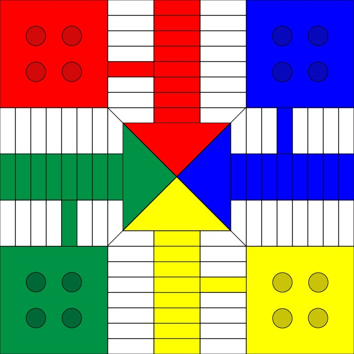

# Parqués  utilizando POO
____

## 1. Introducción

<p align="center"></p>

El parqués es un juego de mesa de origen colombiano, derivado del parchís español. Este juego permite de 2 a 4 jugadores y se juega con un tablero como el mostrado anteriormente, en el cual se ubican 4 fichas por jugador del color correspondiente. El objetivo de este juego es recorrer todo el tablero en sentido antihorario con cada una de tus fichas, hasta llevarlas al centro de este y coronarlas, mientras que en el recorrido se come las fichas de los otros jugadores para evitar que se coronen. El primer jugador en coronar sus 4 fichas gana.
En nusestra versión del parqués añadimos las siguientes reglas:

 * Si algún dado o la suma de ambos es 5 sale 1 ficha de la cárcel
 * Si se saca el mismo número con ambos dados se da un turno extra (máximo 3 veces)
 * Pueden haber máximo 2 fichas por casilla. En este caso se forma un bloqueo
 * Si un jugador come una ficha de otro jugador obtiene 20 puntos para mover con 1 de sus fichas
 * Los seguros cambian de lugar cada 4 rondas

## 2. Representación del tablero
En este parqués representamos el tablero mediante una lista de 68 elementos que representa cada una de las casillas, cada uno de estos elementos es a su vez una lista de 6 elementos que guardan la siguiente información de la casilla {Coordenada en X, Coordenada en Y, Casilla segura, Bloqueos en la casilla, # de fichas que tiene, # del jugador en la casilla}


## 3. Clases
En el parqués se manejan 2 clases: la clase ficha y la clase jugador.
### 3.1 Clase Ficha
Cada elemento de la clase ficha cuenta con las siguientes variables: coordenadas de la cárcel, casilla actual de la ficha, casillas avanzadas por la ficha, número del jugador dueño de la ficha, color de la ficha y estado de la ficha (en la cárcel o no).
#### Constructor
La ficha se crea a partir de las coordenadas de su cárcel y el jugador al que pertenece, según este se le asigna un color y la casilla a la cual debe salir.
```processsing
Ficha(int jugador, int carcelX, int carcelY) {
    ficha_en_carcel = true;                                  //La ficha inicia en la carcel
    color_ficha = colores[jugador-1];                        //Se le asigna el color del jugador
    carcel[0]=carcelX;                                       //Guardamos las coordenadas de la carcel
    carcel[1]=carcelY;
    numero_jugador = jugador;
    //Asigna valores segun el jugador
    switch(jugador) {
    case 1:
      casilla_actual = 0;  //su salida
      break;
    case 2:
      casilla_actual = 17;  //su salida
      break;
    case 3:
      casilla_actual = 34;  //su salida
      break;
    case 4:
      casilla_actual = 51;  //su salida
      break;
    }
    casillas_coronar = 8;
    entrada = false;
  }
```
#### Método Dibujar
Una ficha se dibuja de acuerdo a las variables x y y, estas variables solo cambian cuando se presentan bloqueos, es decir 2 fichas en una casilla. Cuando la ficha está sola (x=0 y y=0) se dibuja la ficha en el centro de la casilla actual en la que está
```Processing
void dibujar(int x, int y) {
    push();
    stroke(0);
    strokeWeight(2);
    fill(color_ficha);
    
    if (x == 0 && y == 0) {
      if (ficha_en_carcel==false) {                                                //Verificamos si la ficha está en juego o en la carcel y se dibuja
        circle(tablero[casilla_actual%68][0], tablero[casilla_actual%68][1], 30);
      } else {
        circle(carcel[0], carcel[1], 30);
        casillas_avanzadas = 0;
      }
    } else {
      circle(x, y, 30);
    }
    pop();
  }
```
#### Método Mover
Una ficha se mueve dependiendo unicamente de el número de casillas a mover, esta variable aumenta la casilla actual y le indica al tablero que en esa casilla ahora hay una ficha
```Processing
  void mover(int espacios) {
    tablero[casilla_actual%68][4] -= 1;
    if (tablero[casilla_actual%68][4]==0 ) {
      tablero[casilla_actual%68][5] = 0;
    }
    if (tablero[casilla_actual%68][4] < 2) {
      tablero[casilla_actual%68][3] = 0;
    }
    casilla_actual += espacios;
    casillas_avanzadas+=espacios;
    tablero[casilla_actual%68][4] += 1;
    tablero[casilla_actual%68][5] = numero_jugador;
  }
```
#### Método Entrar
```Processing
void entrar(int casillas) {
    if ((casillas_coronar - casillas) >= 0) {
      casillas_coronar -= casillas;
      movida = true;
      if (casillas_coronar == 0) {
        ficha_coronada = true;
      } else {
        ficha_coronada = false;
      }
    } else {
      movida = false;
    }
  }
```

### 3.2 Clase Jugador
Cada jugador de la clase jugador se crea con 4 fichas que pertenecen a la clase Ficha, también cada jugador tiene las siguientes variables: fichas_enCarcel, ficha_a_mover, espacios_avanzados, jugador y entrada.
#### Constructor
El constructor de esta clase se encarga de crear las 4 fichas del jugador, con sus coordenadas de la cárcel y color dependiendo del número de jugador.
```Processing
Jugador(int numerodejugador) {
    jugador = numerodejugador;
    //Cada jugador tiene un número asignado del cual depende su color y su turno
    // se crea cada ficha con las coordenadas de su carcel 
    if (numerodejugador==1) {
      ficha1 = new Ficha(1, 550, 550);
      ficha2 = new Ficha(1, 620, 550);
      ficha3 = new Ficha(1, 550, 620);
      ficha4 = new Ficha(1, 620, 620);
      entrada = 0;
    } else if (numerodejugador==2) {
      ficha1 = new Ficha(2, 550, 70);
      ficha2 = new Ficha(2, 620, 70);
      ficha3 = new Ficha(2, 550, 140);
      ficha4 = new Ficha(2, 620, 140);
      entrada = 17;
    } else if (numerodejugador==3) {
      ficha1 = new Ficha(3, 70, 70);
      ficha2 = new Ficha(3, 140, 70);
      ficha3 = new Ficha(3, 70, 140);
      ficha4 = new Ficha(3, 140, 140);
      entrada = 34;
    } else if (numerodejugador==4) {
      ficha1 = new Ficha(4, 70, 550);
      ficha2 = new Ficha(4, 140, 550);
      ficha3 = new Ficha(4, 70, 620);
      ficha4 = new Ficha(4, 140, 620);
      entrada = 51;
    }
  }
```
#### Método DibujarFichas
```Processing
//Dibujamos las 4 fichas del jugador
  void DibujarFichas() {
    ficha1.dibujar(x1, y1);
    ficha2.dibujar(x2, y2);
    ficha3.dibujar(x3, y3);
    ficha4.dibujar(x4, y4);
    bloqueo();
  }
```
#### Método TirarDados
Este método varia el valor de los dados, verifica si si sacan 2 números iguales y llama los métodos: moverFichas, SacarCarcel.
```Processing
void TirarDados() {
    Dado1= (int)random(6) +1;
    Dado2= (int)random(6) +1;
    espacios = Dado1 + Dado2;
    MoverDado1= true;
    MoverDado2= true;
    SacarCarcel();
    //Verifica si se puede avanzar de turno
    if (Dado1 == Dado2) {
      pares ++;
      if (pares == 3) {
        turnoActual=true;
        Turno ++;
        pares = 0;
      }
    } else {
      pares = 0;
    }
    if (fichas_enCarcel == 4 && pares == 0) {
      turnoActual=true;
      Turno ++;
    }
    if (espacios==0 && pares==0) {
      turnoActual=true;
      Turno ++;
    }
  }
```
#### Método MoverFicha
Guarda a cual ficha del jugador se le da click, luego guarda a cual dado se selecciona y verifica si se puede mover (no hay bloqueos).Si es así se mueve y ejecuta el método Comer
#### Método SacarCárcel
Si el dado 1, el dado 2 o la suma de los dados es 5 se recorren las 4 fichas del jugador, la primera que encuentre que esté en la carcel la ubica en la salida del jugador.

#### Método Bloqueo
Se verifica si la casilla tiene 2 fichas, si es asi mira si las fichas son del mismo jugador y se arma bloqueo. Si son de distinto jugador, verifica si la casilla es seguro, si no come esa ficha

#### Método Comer
Verfica que la casilla donde está no sea segura (si lo es se genera un bloqueo), luego compara con cada jugador y con cada una de sus fichas si están en el mismo lugar. Si están en el mismo lugar, envía a esa ficha a la cárcel y le da al jugador la oportunidad de avanzar 20 casillas con una de sus fichas

## 4. Funciones

### 4.1 Dibujar bloqueo
```Processing
void dibujarBloqueo() {
  for (int n = 0; n < 68; n++) {
    if (tablero[n][3] == 1) {
      

      push();
      noStroke();
      fill(#93663A);

      //Casillas Horizontales
      if ((n <= 2) || (n >= 22 & n <= 36) || (n >= 56)) {
        rect(tablero[n][0]-45, tablero[n][1]-15, 90, 30);
      }

      //Casillas Verticales
      else if ((n>=5 && n<=19)||(n>=39 && n<=53)) {
        rect(tablero[n][0]-15, tablero[n][1]-45, 30, 90);
      }
```
### 4.2 Seguros
Los seguros se dibujan en el void draw() pero varian cuando se da enter y han pasado 4 rondas
```Processing
void Seguros(){
  //Cada 4 rondas cambian de lugar los seguros
  int [] seguros = {seguro1, seguro2};
  fill(#9c9c9c);
  
  for(int i=0; i<2; i++){
    //Dibujamos los seguros para las 4 partes del tablero
  }
}
```


